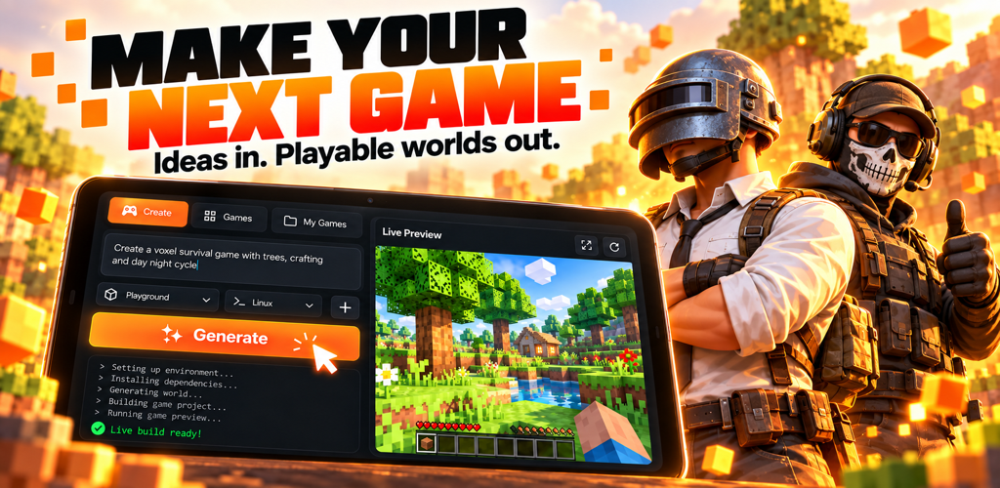
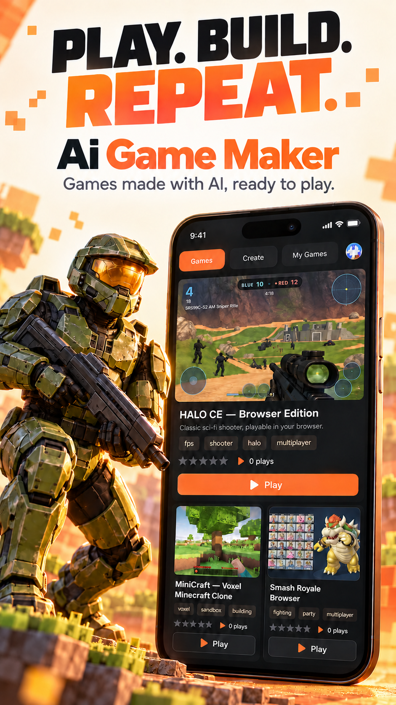
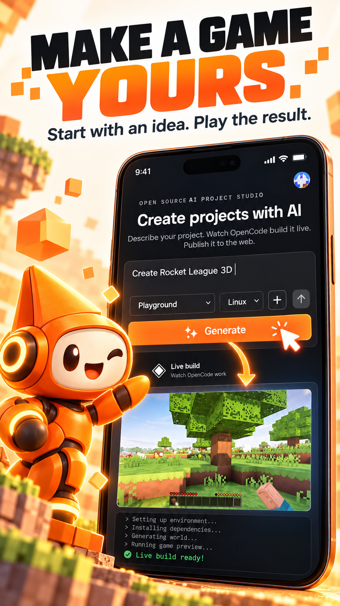
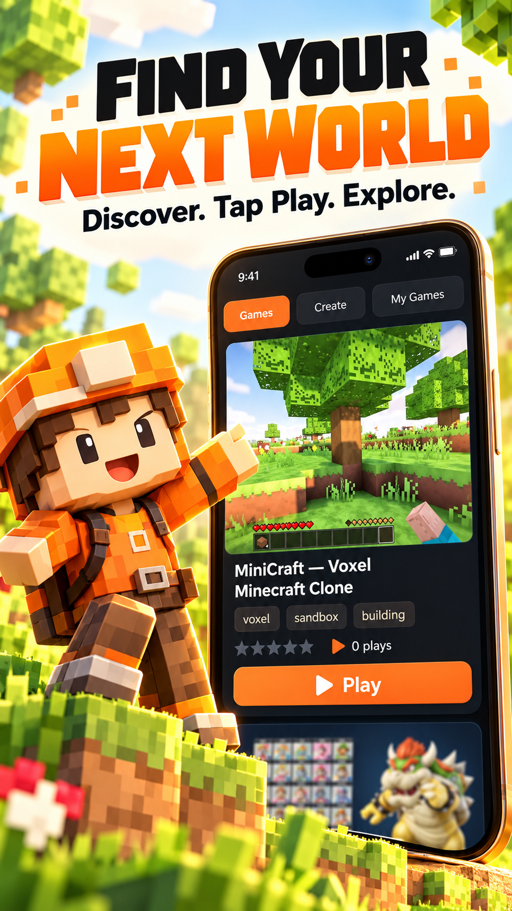
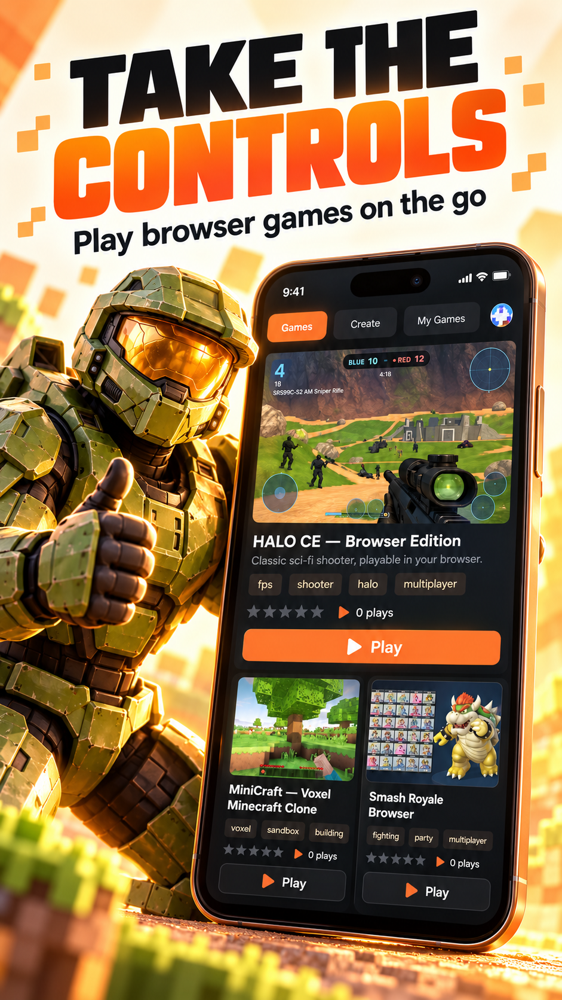

# 🎮 Ai Game Maker

### 🚀 Turn an idea into a playable world. 🚀

 

> **Bring an idea. Build a game. Play it.**
> Create, explore, and share browser-game worlds with Ai Game Maker.

---

## 🧠 TL;DR

> **No account required. No in-app purchases. Optional GitHub integration.**

Read the [Privacy Policy](https://submitgame.github.io/ai-game-maker-privacy/) before using the app or connecting GitHub. Review the GitHub permissions shown during authorization.

## 📱 See It in Action

<table>
<tr>
<td align="center"> <b>🎮 Discover and play</b></td>
<td align="center"> <b>✨ Create and build</b></td>
</tr>
<tr>
<td align="center"> <b>🌍 Explore worlds</b></td>
<td align="center"> <b>🕹️ Play your way</b></td>
</tr>
</table>

## ⚡ Make Something Playable

> **Start with a prompt. Keep shaping the result.**

- 🧠 Describe a game idea in plain language.
- 🛠️ Follow the build and preview the result.
- 🎮 Play browser games from creators.
- 🌐 Publish and share a playable link.
- 🔗 Connect GitHub only when you choose to use its integration.
- 🧩 Explore projects by title, tag, or creator.
- 📱 Try experiences across supported devices.
- ✍️ Refine a game with follow-up prompts.

## 🔐 Privacy First

> **Know what leaves your device before you create.**

Ai Game Maker does not require an account and does not offer in-app purchases. When you request AI game creation, your prompt and related project content are processed by the services needed to build and preview the game. If you connect GitHub, information is exchanged with GitHub for the actions you authorize.

[Read the full Privacy Policy →](https://submitgame.github.io/ai-game-maker-privacy/)

## 📁 Project Contents

- 🖼️ `images/featureGraphic.png` — Google Play feature graphic.
- 📱 `images/` — app listing screenshots.
- 🔒 `docs/index.html` — public privacy policy page.

---

**Build the idea. Play the result.** 🎮

*Pixels are better when you can press the buttons.* 😏

